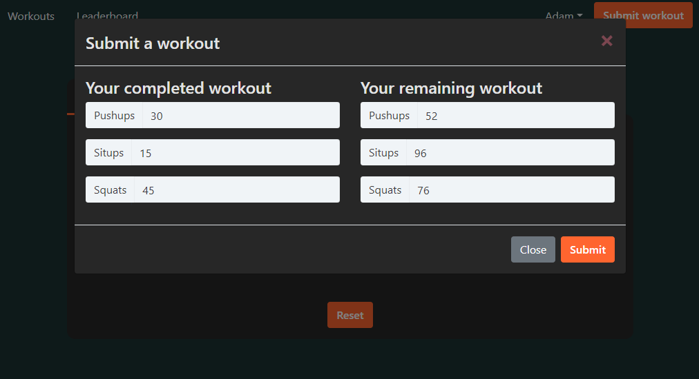

# Game Workout App

Inspired by the COVID-19 lockdowns and complaints about gym closures, this project is intended to provide motivation for home workouts by providing workouts based on video game performance.

# Setting up the project

To run this project, you will need `Docker` and `npm` installed globally on your machine.

Start by cloning this repository and following the instructions below.

## Environment variables:

You will need a `.env` file with these variables:

- MONGO_USERNAME
- MONGO_PASSWORD
- JWTSecret
- RiotApiKey

## Running:

To run:

`docker compose up -d --build` 

To run with logs:

`docker compose up -d --build; docker compose logs -f -t`  

To close the app:  

`docker compose down`  

To close the app then rebuild:  

`docker compose down; docker compose up -d --build; docker compose logs -f -t`  

# About the project 

## Key Features:

- User accounts with salting/hashing, JWT, and authentication cookies.
- Microservice-style app with docker to orchestrate.
- Retaining a list of outstanding workouts in MongoDB. 
  - Increased by completing a game and filling out a form to gauge performance.
  - Decreased by entering the exercises completed.
- Leaderboard of outstanding workouts - intented to motivate users to complete workouts as they receive them.

## Project Screen Shots:

### Filling out a game performance form

### Receiving a workout based on game performance

### Entering a completed workout

### Viewing the leaderboard

