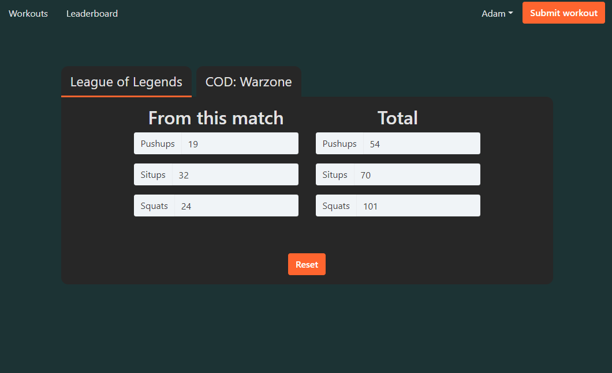

## Game Workout Client

**This is only the client-side portion of this project. You can view the server side [here](https://github.com/adbollinger/game-workout-server).**

Inspired by the COVID-19 lockdowns and complaints about gym closures, this project is intended to provide motivation for home workouts by providing a list of exercise based on video game performance.

### Key Features:

- User accounts with salting/hashing, JWT, and authentication cookies.
- Retaining a list of outstanding workouts in MongoDB. 
  - Increased by completing a game and filling out a form to gauge performance.
  - Decreased by entering the exercises completed.
- Leaderboard of outstanding workouts - intented to motivate users to complete workouts as they receive them.

## Project Screen Shots

### Filling out a game performance form

### Receiving a workout based on game performance

### Entering a completed workout

### Viewing the leaderboard

## Installation and Setup Instructions

To run this project, you will need `Node` installed globally on your machine.

Start by cloning this repository and following the installation instructions below.

### Installation:

**This installation only covers the client-side portion of this project.**

Install dependancies

`npm install`  

Run the client:  

`npm run start`  

Once the [server](https://github.com/adbollinger/game-workout-server#installation-and-setup-instructions) is set up, you can run the server and the client together.

Navigate to the server directory and type:

`npm run dev`  

